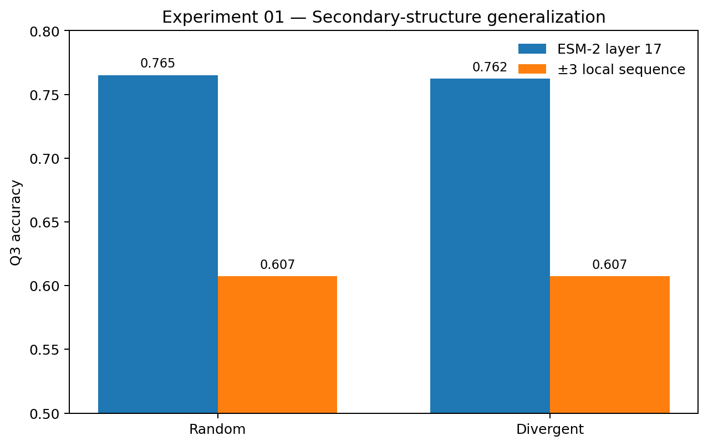
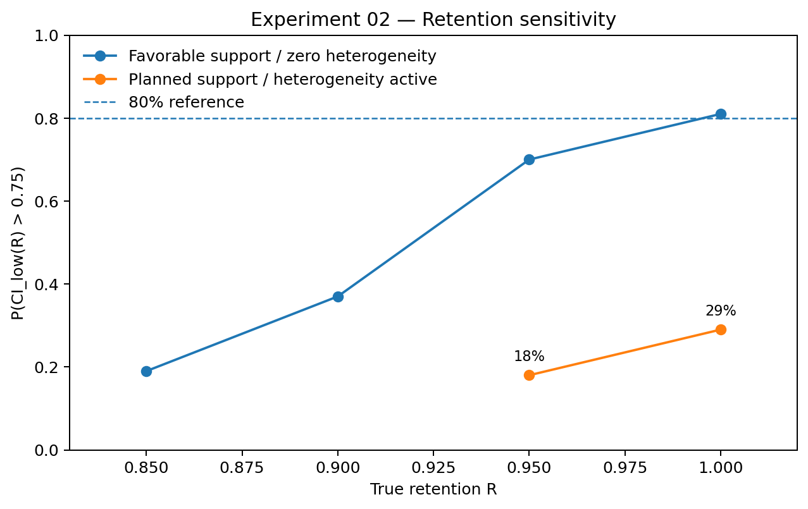

# Protein representation generalization

**Does biological information encoded inside a protein foundation model survive explicit sequence-divergence controls?**

This project tests internal biological representations under explicit sequence divergence rather than assuming that in-distribution probe performance transfers.

The experiments use frozen representation choices, explicit local-sequence comparators, sequence-identity cluster holdouts, cluster-level uncertainty estimates, and pre-data decision rules.

---

## Experiment 01 — Secondary structure

**Complete. Frozen verdict: `H_repr`.**

Experiment 01 tests whether per-residue Q3 secondary-structure information in ESM-2 650M layer 17 survives a 30%-sequence-identity cluster holdout, or collapses toward an explicit ±3-residue local-sequence baseline.

<p align="center">
  
</p>

| Representation | Random Q3 | Divergent Q3 | Divergent macro-F1 |
|---|---:|---:|---:|
| ESM-2 layer 17 | 0.765166 | 0.762263 | 0.758054 |
| ±3 local sequence | 0.607324 | 0.607224 | 0.568602 |

Preregistered quantities:

- **Δ_ESM(divergent) = +0.155039**, 95% cluster-bootstrap CI **[+0.151, +0.159]**
- **G = +0.002903**, 95% cluster-bootstrap CI **[-0.003, +0.009]**

The frozen `H_repr` criterion required Δ_ESM ≥ 0.08 and G ≤ 0.10. Both conditions are satisfied.

For this target, the fixed ESM-2 representation retains substantial linearly accessible information beyond local sequence context and shows essentially no degradation under the divergent cluster-held-out test.

See the [frozen protocol](experiments/01-secondary-structure/PROTOCOL.md) and [full result](experiments/01-secondary-structure/results.md).

**Zenodo:** [10.5281/zenodo.22134890](https://doi.org/10.5281/zenodo.22134890)


---

## Experiment 02 — Catalytic residues

**Closed pre-data. No biological verdict.**

Experiment 02 was designed to ask a harder question:

> Does linearly accessible catalytic-site information in ESM-2 survive a 30%-identity family holdout beyond what can be recovered from local amino-acid context?

The experiment never reached confirmatory M-CSA label construction or ESM evaluation.

Its pre-data precision analysis found that the **planned split could not estimate the required retention quantity reliably enough to support the confirmatory decision rule**.

<p align="center">
  
</p>

The binding quantity was

`R = Δ_div / Δ_rand`

with `H_repr` requiring:

`CI_low(R) > 0.75`.

Under a favorable synthetic configuration with equal support and zero cluster heterogeneity, near-complete retention was detectable:

| True R | Detection probability |
|---:|---:|
| 0.85 | 0.19 |
| 0.90 | 0.37 |
| 0.95 | 0.70 |
| 1.00 | 0.81 |

But under the planned support — approximately **100 random-test clusters / 420 positives** and **170 divergent-test clusters / 700 positives**, with cluster heterogeneity active — sensitivity collapsed:

| True R | Mean R̂ | Mean log-R half-width | Calibration ratio | Detection |
|---:|---:|---:|---:|---:|
| 0.95 | 0.949 | 0.411 | 0.967 | 0.18 |
| 1.00 | 1.027 | 0.412 | 0.928 | 0.29 |

The bootstrap remained calibrated against across-dataset variability, and all retention bootstrap replicates were valid.

So the stopping result is about the **experimental design**, not the biological hypothesis:

> Even when true retention is complete, the planned configuration satisfies the required lower confidence bound in only 29% of calibrated simulations.

No confirmatory M-CSA label pool was built, no ESM-2 embeddings were extracted, no probe was fit, and no test split was evaluated.

See the [draft protocol](experiments/02-catalytic-residues/PROTOCOL.md), [pre-data precision analysis](experiments/02-catalytic-residues/PRE_DATA_PRECISION.md), [implementation audit](experiments/02-catalytic-residues/IMPLEMENTATION_NOTES.md), and [result](experiments/02-catalytic-residues/results.md).

---

**Zenodo:** [10.5281/zenodo.22164680](https://doi.org/10.5281/zenodo.22164680)

## Split audit — Experiment 01

The final canonical dataset contains **11,373 proteins, 11,043 clusters, and 2,875,432 residues**.

The divergent split shares **zero clusters** with training or random test.

The per-split cluster counts sum to 11,091 because **48 clusters contain different proteins in both training and the in-distribution random test**. Subtracting that intentional overlap reconciles exactly to the 11,043 unique clusters.

Protein membership is disjoint across all three splits.

---

## Citable releases

### Experiment 01 — secondary-structure representation generalization

Ochola, A. (2026). *Protein representation generalization: ESM-2 secondary-structure information under a 30%-identity cluster holdout*. Zenodo.  
https://doi.org/10.5281/zenodo.22134890

### Experiment 02 — catalytic-residue pre-data feasibility

Ochola, A. (2026). *Pre-data feasibility analysis for catalytic-residue representation generalization under a 30%-identity family holdout* (Version 1.0.0). Zenodo.  
https://doi.org/10.5281/zenodo.22164680

---

## Implementation discipline

The project treats experimental design and the tools used to validate that design as objects that themselves require testing.

Experiment 01 froze its protocol before extraction and probing. Before any confirmatory metric was observed, the split was canonicalized using content-derived identifiers and tested for invariance to arbitrary row order and cluster names.

After the primary Exp 01 metrics were observed, the slow cluster bootstrap was optimized using per-cluster sufficient statistics. The optimization was accepted only after demonstrating equivalence to the frozen residue-concatenation computation. The final 2,000-replicate cluster bootstrap takes **1.797 seconds**.

Experiment 02 exposed a second lesson: a **feasibility simulator is itself an instrument**.

Early simulations incorrectly suggested that the experiment should close. Two defects were subsequently identified:

1. baseline and ESM arms were generated independently, artificially inflating variance in difference-based statistics;
2. signal strength was re-tuned to target AP inside every outer dataset, suppressing the across-dataset variation required for a valid power estimate.

Both defects were corrected before any confirmatory biological data were accessed.

The final simulator was accepted only after its bootstrap uncertainty agreed with actual across-dataset variation. Under the final planned-support configuration, calibration ratios were **0.967** and **0.928**.

The final stopping decision therefore rests on a validated feasibility instrument rather than the earlier defective simulations.

---

## Structure

```text
protein-representation-generalization/
├── README.md
├── src/
│   └── power_sim.py
├── notebooks/
├── experiments/
│   ├── 01-secondary-structure/
│   │   ├── PROTOCOL.md
│   │   ├── IMPLEMENTATION_NOTES.md
│   │   └── results.md
│   └── 02-catalytic-residues/
│       ├── PROTOCOL.md
│       ├── PRE_DATA_PRECISION.md
│       ├── IMPLEMENTATION_NOTES.md
│       └── results.md
├── results/
│   ├── ss_generalization.csv
│   ├── ss_summary.json
│   ├── provenance.json
│   └── power_sim/
└── figures/
    ├── exp01_q3_generalization.png
    └── exp02_retention_feasibility.png
```

---

## Status

**Experiment 01:** complete — `H_repr`.

**Experiment 02:** closed pre-data — insufficient precision for the planned retention criterion; **no biological verdict**.

Together, the two experiments separate two questions that are easy to conflate:

- Does a fixed protein-model representation retain biological information across explicit sequence divergence?
- Is the available dataset large enough to measure that retention with a decision rule strong enough to support the claim?

Experiment 01 answers the first positively for secondary structure.

Experiment 02 shows that for a smaller, function-relevant catalytic-residue benchmark, the second question can become the binding constraint before the biological hypothesis is tested.