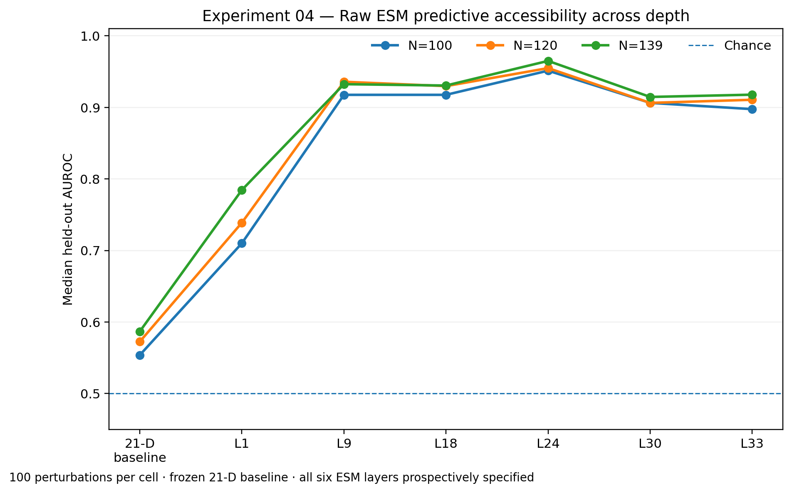
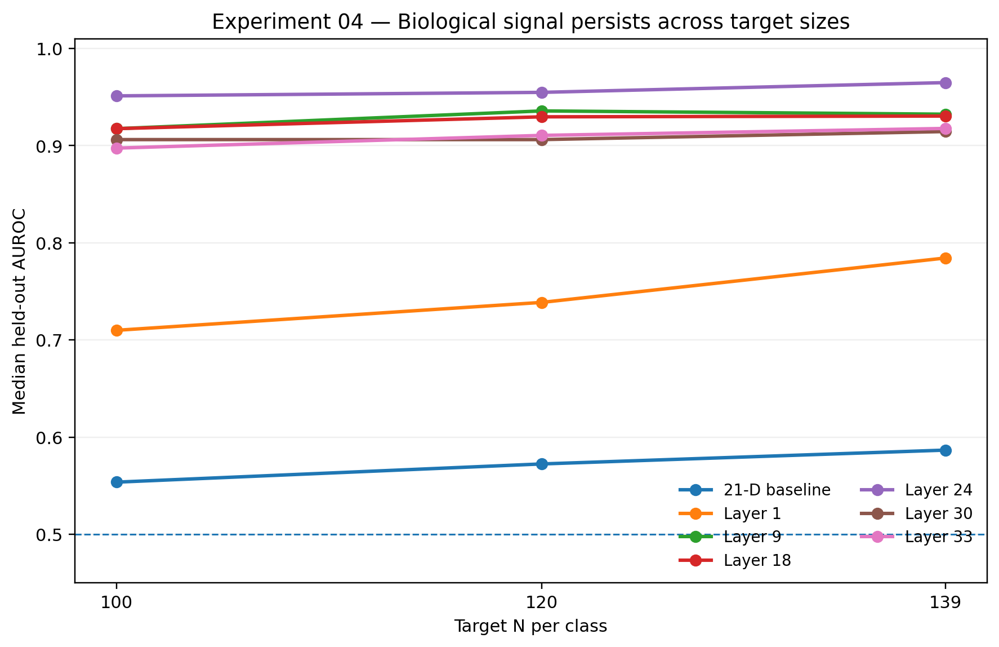
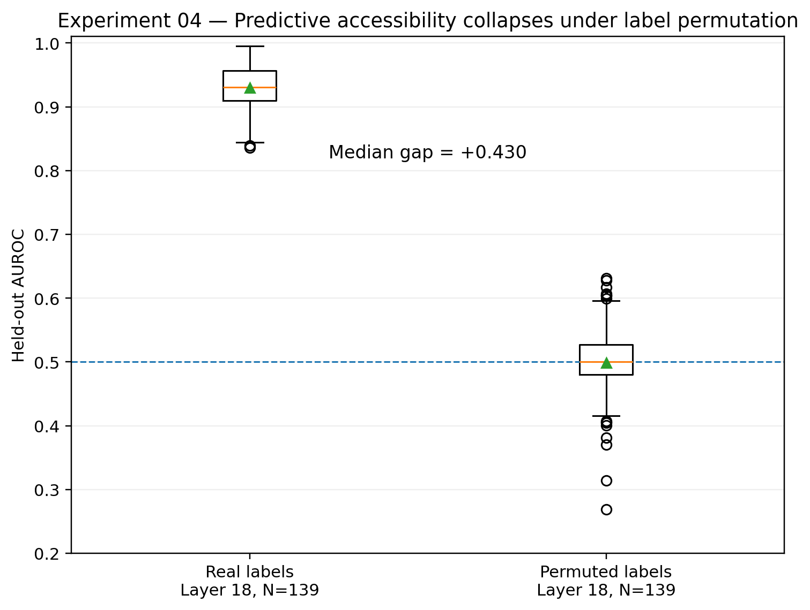
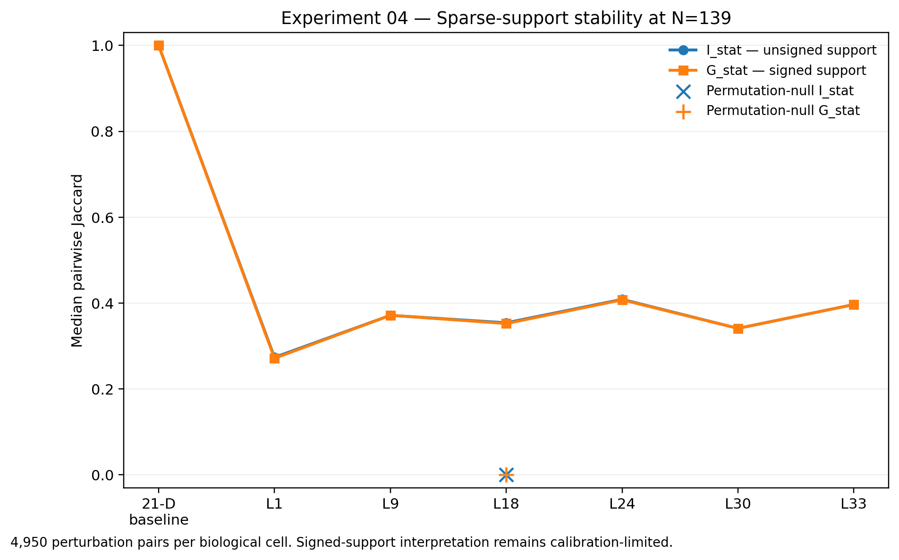

# Experiment 04 — Depth and Basis

## Phase P Biological Probing — Final Results

**Status: COMPLETE — descriptive/exploratory biological Arm-B result**

Phase P completed under the same frozen protected execution identity with
2,100 / 2,100 main rows and 100 / 100 scoped permutation-null rows.

No new biological threshold, post-hoc layer-selection rule, or
confirmatory criterion is introduced in this result.

---

## 1. Execution integrity

- Scientific HEAD: `5277f686ad09ead8921462cb9ed9a53324007c42`
- Production runner SHA-256: `e0a39b9c7a83943248166c6251ef273c9505dfece23eff4cbb6531c163cbaeec`
- Execution manifest SHA-256: `f5049a77f210b53e58ded918d8cbce9444444fd141df86f61a94dc8aa460e7ba`
- Main CSV SHA-256: `5ec2ce9810d344613b91117fe72e76d54306ba8ae2402a3e31ff327bfb93841c`
- Permutation-null CSV SHA-256: `2657f3f7a04b5ebe50a9e0514cefdf94d22b6d92a8695c8b957602d97348c6ae`
- Main perturbations: 100
- Target sizes: N = 100, 120, 139 per class
- Representations: six raw ESM-2 layers plus frozen 21-D sequence baseline
- Main rows: 2,100 / 2,100
- Permutation-null rows: 100 / 100
- Null replay membership SHA verification: 100 / 100

The completed main factorial is exactly:

`100 perturbations × 3 target sizes × 7 representations = 2,100 rows`.

The scoped permutation null is exactly:

`100 perturbations × layer 18 × N=139`.

---

## 2. Primary question

### Is toxin-related biological information linearly accessible in raw ESM-2 representations?

**Yes, strongly within the frozen discovery universe.**

Raw ESM representations substantially outperform the frozen
21-dimensional sequence-length/amino-acid-composition baseline.

| Representation   |   Mean AUROC |   Median AUROC |   N=100 median |   N=120 median |   N=139 median |
|:-----------------|-------------:|---------------:|---------------:|---------------:|---------------:|
| 21-D baseline    |        0.563 |          0.569 |          0.554 |          0.572 |          0.587 |
| Layer 1          |        0.741 |          0.742 |          0.71  |          0.739 |          0.784 |
| Layer 9          |        0.927 |          0.929 |          0.917 |          0.936 |          0.932 |
| Layer 18         |        0.923 |          0.927 |          0.917 |          0.93  |          0.93  |
| Layer 24         |        0.955 |          0.958 |          0.951 |          0.955 |          0.965 |
| Layer 30         |        0.902 |          0.911 |          0.906 |          0.906 |          0.915 |
| Layer 33         |        0.901 |          0.91  |          0.897 |          0.911 |          0.918 |

Layer 24 has the highest descriptive median/mean accessibility across the
tested depths. This is reported as part of the complete six-layer profile;
layer 24 was not prospectively selected as the sole biological target.

At N=139:

- Layer 24 median AUROC: **0.965**
- Layer 18 median AUROC: **0.930**
- 21-D baseline median AUROC: **0.587**

The result therefore cannot be explained by the frozen simple
length/composition baseline alone.

---

## 3. Paired raw-ESM minus baseline comparison

Each raw-ESM AUROC is paired to the baseline using the same biological
perturbation identity, target N, target-N membership, and Stage-A split.

| Representation   |   Mean ΔAUROC |   Median ΔAUROC |   Wins / 300 |   Losses / 300 |
|:-----------------|--------------:|----------------:|-------------:|---------------:|
| Layer 1          |         0.177 |           0.171 |          290 |             10 |
| Layer 9          |         0.364 |           0.361 |          300 |              0 |
| Layer 18         |         0.36  |           0.357 |          300 |              0 |
| Layer 24         |         0.392 |           0.387 |          300 |              0 |
| Layer 30         |         0.338 |           0.339 |          300 |              0 |
| Layer 33         |         0.337 |           0.335 |          300 |              0 |

Layer 24 exceeds its matched sequence baseline in
**300 / 300** comparisons, with:

- mean paired ΔAUROC = **+0.392**
- median paired ΔAUROC = **+0.387**

Layer 1 is substantially weaker than the middle/deeper ESM layers but still
beats the matched baseline in **290 / 300** comparisons.

No significance threshold or biological PASS/FAIL boundary is attached to
these descriptive paired distributions.

---

## 4. Target-N robustness

The high-accessibility middle/deeper-layer pattern persists across all
three frozen target sizes.

Layer 24 remains strongest descriptively at N=100, N=120, and N=139.

The depth profile is non-monotonic: accessibility rises sharply from layer
1 into the middle layers, reaches its highest observed values around layer
24, and remains high but lower at layers 30 and 33.

---

## 5. Scoped label-permutation null

The preregistered null is restricted to layer 18 at N=139.

- Biological median AUROC: **0.930**
- Permutation-null median AUROC: **0.500**
- Median biological-minus-null gap: **+0.430**

The permutation-null median is at chance, whereas the real biological
anchor remains strongly predictive.

This indicates that the observed biological accessibility is not reproduced
by applying the same probe machinery to randomly permuted class labels.

The null is contextualizing rather than confirmatory: it does not create a
new biological significance threshold.

---

## 6. Sparse-support stability

For each biological cell, support stability is summarized over all
`100 choose 2 = 4,950` perturbation pairs.

- `I_stat`: median pairwise Jaccard overlap of unsigned stability supports.
- `G_stat`: median pairwise Jaccard overlap of signed stability supports.

### N=139

| Representation         |   I_stat |   G_stat |   Median K_stab |
|:-----------------------|---------:|---------:|----------------:|
| 21-D baseline          |    1     |    1     |             1   |
| Layer 1                |    0.274 |    0.271 |            77   |
| Layer 9                |    0.371 |    0.371 |            47   |
| Layer 18               |    0.354 |    0.352 |            68   |
| Layer 24               |    0.409 |    0.407 |            67   |
| Layer 30               |    0.341 |    0.341 |            79   |
| Layer 33               |    0.397 |    0.397 |            39   |
| Permutation null — L18 |    0     |    0     |             2.5 |

The real biological ESM representations show substantially more recurrent
coordinate selection than the scoped label-permutation null.

`G_stat` closely tracks `I_stat` across the biological layers, indicating
strong descriptive sign agreement when coordinates recur.

However, signed-support interpretation remains **calibration-limited**:
the failed stronger S7-v2 signed-instability criterion is not replaced,
lowered, or retrospectively redefined.

---

## 7. Anchor-layer coordinate recurrence

At the protocol-designated layer-18/N=139 anchor, the biological support
recurrence distribution is more concentrated than the label-permutation
null.

|   Minimum recurrence / 100 |   Biological coordinates |   Null coordinates |
|---------------------------:|-------------------------:|-------------------:|
|                          1 |                      328 |                994 |
|                         10 |                      138 |                  6 |
|                         25 |                       83 |                  2 |
|                         50 |                       52 |                  1 |
|                         75 |                       17 |                  0 |
|                         90 |                       10 |                  0 |
|                        100 |                        4 |                  0 |

These coordinate-level summaries are descriptive.

They do not establish that individual coordinates are causal toxin
mechanisms or uniquely toxin-specific biological features.

---

## 8. Relationship to Experiment 03

Experiment 03 found weaker stability in the SAE representation.

Experiment 04 shows that the corresponding raw ESM representation contains
strongly linearly accessible toxin-related information and substantially
outperforms the prospectively frozen simple-sequence baseline.

The combined pattern is therefore **consistent with**:

- a representation-basis gap;
- SAE-basis misalignment;
- distributed accessibility;
- or some combination of these explanations.

Experiment 04 does not identify one of these explanations as uniquely
causal.

---

## 9. What Experiment 04 supports

Within the frozen Phase-P descriptive boundary:

1. Toxin-related information is strongly linearly accessible in raw ESM-2
   representations across all six tested depths.
2. Raw ESM substantially outperforms the frozen 21-D
   length/amino-acid-composition baseline.
3. Accessibility has a pronounced depth profile and is highest
   descriptively around layer 24.
4. The high-accessibility pattern persists across N=100, N=120, and N=139.
5. At the layer-18/N=139 anchor, the real-label probe greatly exceeds the
   scoped permutation-null predictive performance.
6. Biological sparse supports show substantially greater recurrence than
   supports generated under label permutation.
7. Signed-support recurrence is descriptively consistent across biological
   perturbations, but remains calibration-limited.

---

## 10. What Experiment 04 does not establish

This experiment does **not** establish:

- a causal toxin mechanism;
- unique toxin specificity;
- a mechanistic decomposition;
- cross-family toxin generalization;
- that a particular raw coordinate is itself a biological mechanism;
- that the SAE failed for one uniquely identified causal reason;
- a confirmatory threshold for I_stat or G_stat;
- a validated signed-support PASS/FAIL criterion.

Phase-P resampling is within the frozen discovery universe.

---

## 11. Final descriptive verdict

> **Toxin-related information is strongly linearly accessible in raw ESM-2
> representations within the frozen discovery universe, substantially beyond
> a simple sequence-length/composition baseline. Accessibility varies across
> depth and is highest descriptively around layer 24. At the
> protocol-designated layer-18/N=139 anchor, real biological labels produce
> high predictive accessibility and substantially more recurrent sparse
> supports than the scoped label-permutation null. Combined with weaker SAE
> stability in Experiment 03, this pattern is consistent with a
> representation-basis gap, SAE-basis misalignment, or distributed
> accessibility.**

---

## 12. Canonical artifacts

| Artifact | SHA-256 |
|---|---|
| Scientific HEAD | `5277f686ad09ead8921462cb9ed9a53324007c42` |
| Production runner | `e0a39b9c7a83943248166c6251ef273c9505dfece23eff4cbb6531c163cbaeec` |
| Execution manifest | `f5049a77f210b53e58ded918d8cbce9444444fd141df86f61a94dc8aa460e7ba` |
| Main per-perturbation CSV | `5ec2ce9810d344613b91117fe72e76d54306ba8ae2402a3e31ff327bfb93841c` |
| Permutation-null CSV | `2657f3f7a04b5ebe50a9e0514cefdf94d22b6d92a8695c8b957602d97348c6ae` |

The production CSV outputs remain outside the public Git history unless a
separate explicit publication decision is made.
